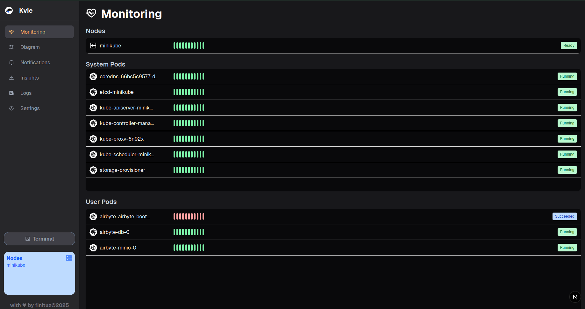
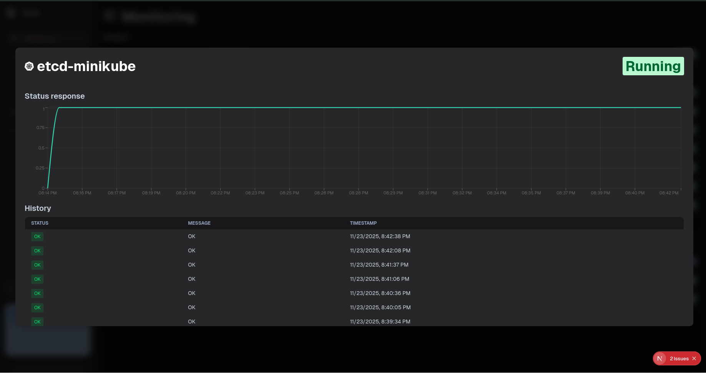
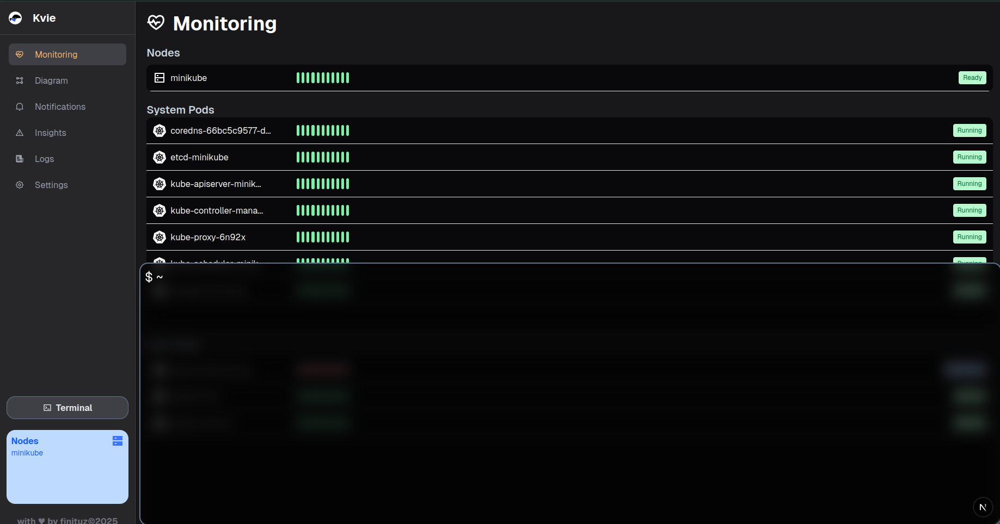

# kvie

kvie is a lightweight, real-time Kubernetes cluster viewer.  
It provides an intuitive visualization of namespaces, pods, logs, and node health metrics, making cluster monitoring simpler and more accessible.

## Features

- Visual namespace layout with automatic grid sizing
- Interactive pod cards with tooltips and basic health information
- Node and pod CPU/Memory metrics
- Live logs visualization
- Insights panel for fast analysis
- Webhook alert support

Interactive visual Kubernetes topology, where namespaces contain organized Pod and resource tiles arranged in a responsive grid layout.


Complete cluster health overview, illustrating node conditions, capacity usage, and workload visibility across the Kubernetes environment.



Live node metrics dashboard featuring CPU and memory usage per node, captured using the Kubernetes Metrics API.



Real-time Kubernetes status from the terminal, showing cluster connectivity, running services and debug messages from the kvie backend.



Cluster logs preview, displaying application logs directly from Kubernetes Pods, with automatic updates and simplified viewing.


## Requirements

- Access to a Kubernetes cluster
- metrics-server running in the cluster

## Development Setup

### Backend (Go)

```bash
cd backend
go mod tidy
go run main.go
```
