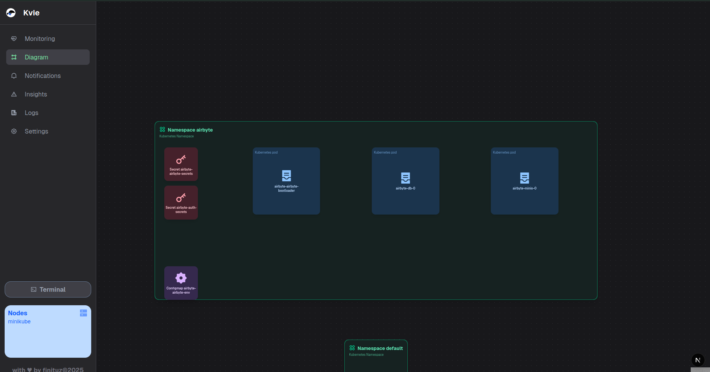

# kvie

kvie is a lightweight, real-time Kubernetes cluster viewer.  
It provides an intuitive visualization of namespaces, pods, logs, and node health metrics, making cluster monitoring simpler and more accessible.

## Features

- Visual namespace layout with automatic grid sizing
- Interactive pod cards with tooltips and basic health information
- Node and pod CPU/Memory metrics
- Live logs visualization
- Insights panel for fast analysis
- Webhook alert support

Interactive visual Kubernetes topology, where namespaces contain organized Pod and resource tiles arranged in a responsive grid layout.



## Requirements

- Access to a Kubernetes cluster
- metrics-server running in the cluster

## Development Setup

### Backend (Go)

```bash
cd backend
go mod tidy
go run main.go
```
